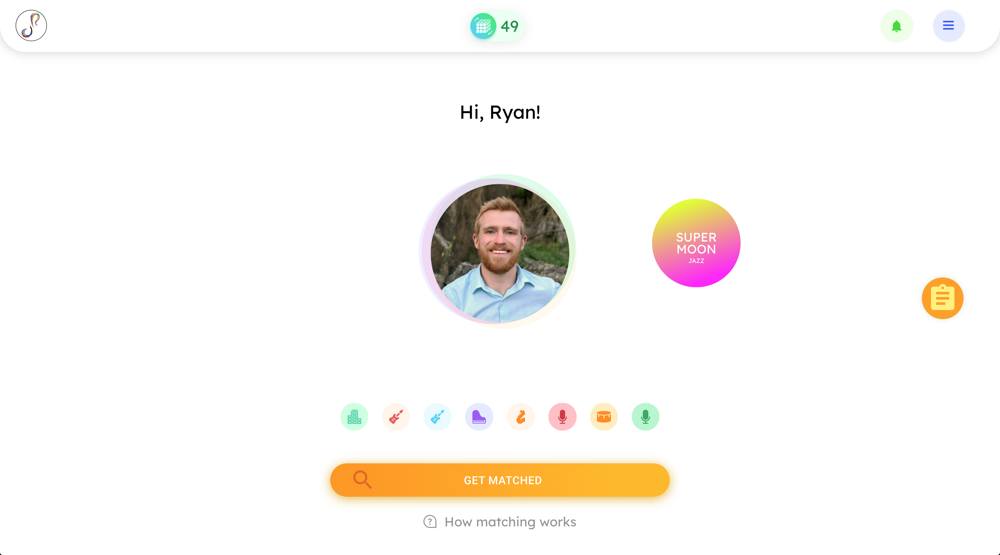
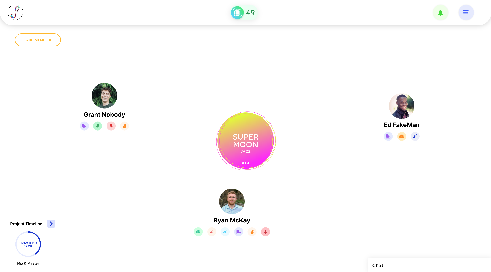
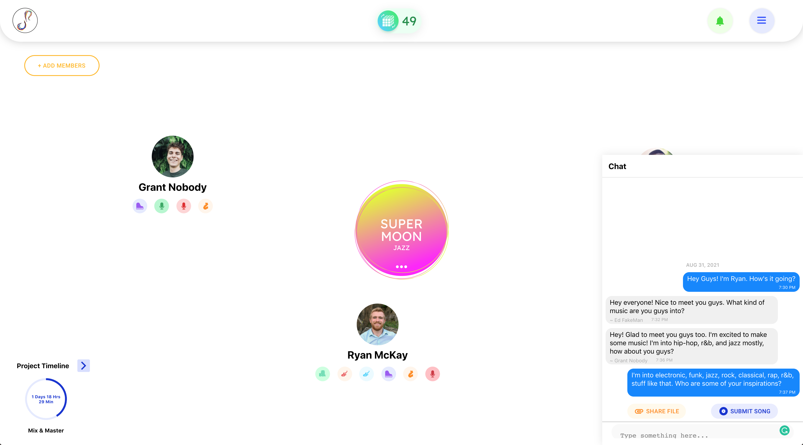
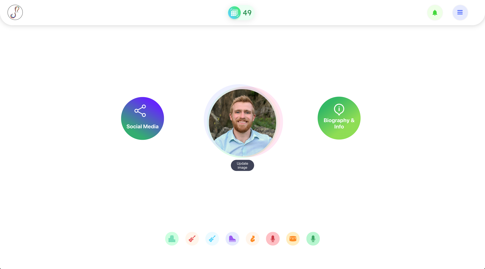
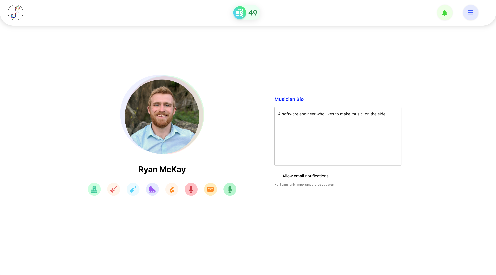
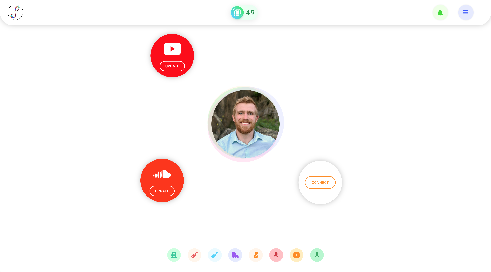
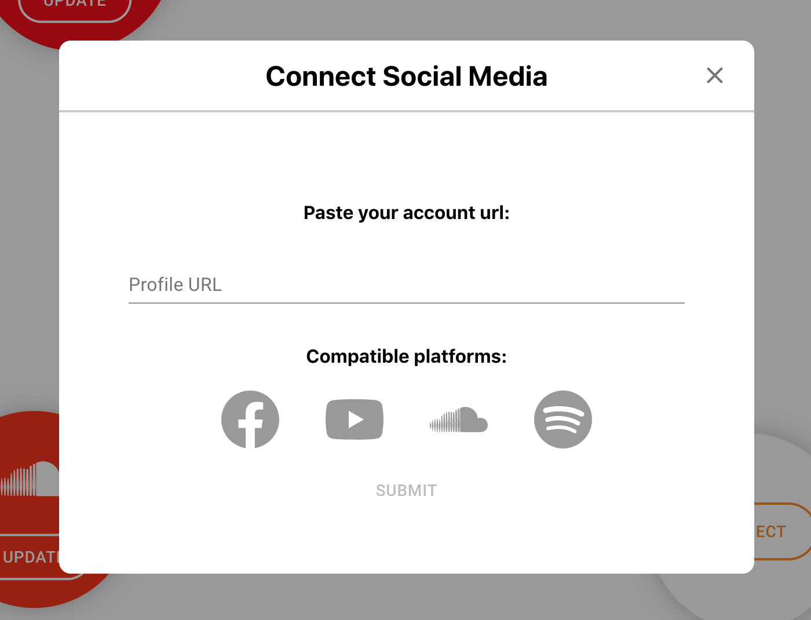
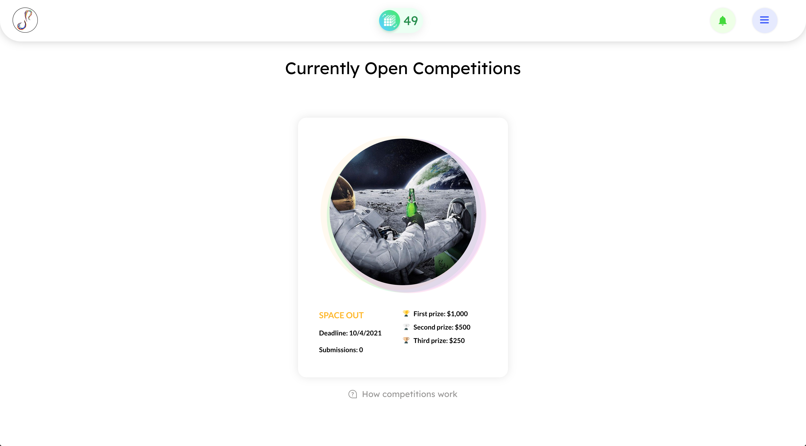
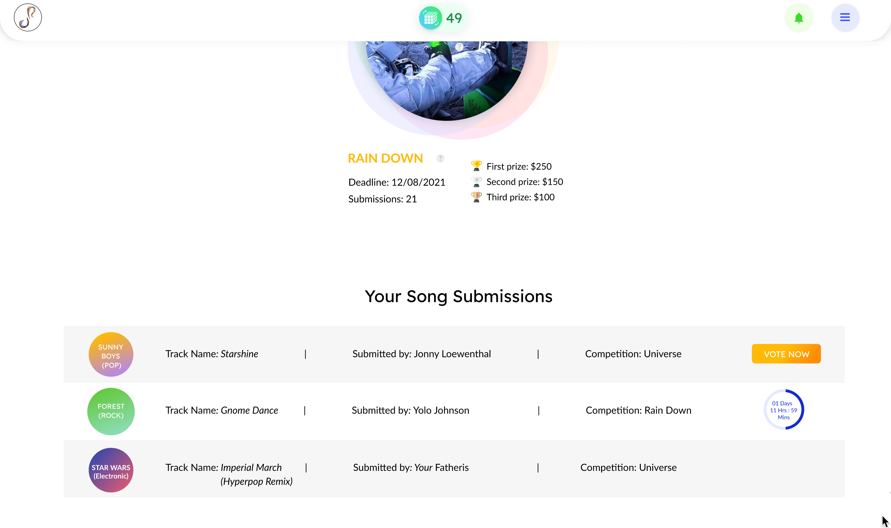
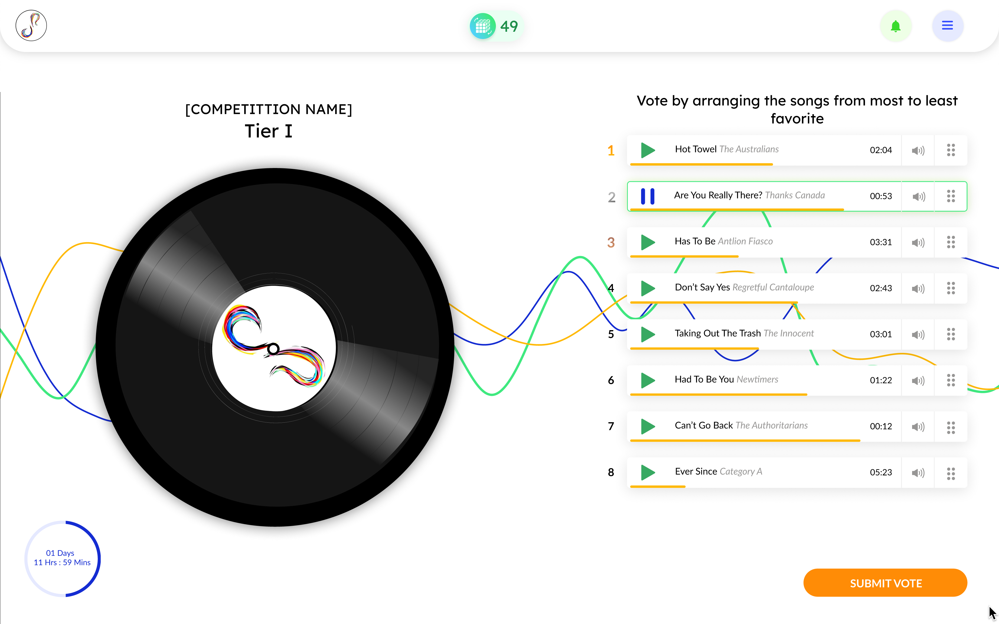

# OnRecord-Project-Overview
Overview of our work with OnRecord

Live site is available at [onrecord.online](https://onrecord.online/), however, most functionality is behind signup, but I have included screenshots of the user interface below.

(I'm actively working on this, More will be coming shortly)
  

# Overview
### What is OnRecord
OnRecord is a social media platform for musicians that aims to match musicians into time-limited groups with other musicians based on their musical interests and skills. Bands have only a couple of weeks to collaborate before their band is dissolved. They can chat, share files, and even submit their projects to a competition with other bands, with the winning bands receiving prizes. The in-app currency, called seshpoints, are used to get matched and to become prize-eligible in a competition. Sheshpoints are currently awarded at regular intervals for active users, as the founders are currently focused on growing their userbase, but eventually they plan to monetize these points.
  
  

# Development Overview

### Proposal
OnRecord came to us in September 2019 with a concept for a socila media app for musical collaboration. The idea was to have musicians to sign up, indicating their musical skills and genres of interest on the form, and then match them into time-limited groups, allowing them to collaborate for a couple of weeks, enter competitions with their groups as they please, and get matched with new people when those groups dissolve. They had run a similar program in person on a few college campuses for a few years prior, and they felt it was time to expand the project. 

They hoped to build
- A nice landing page to attract new users
- A clean & intuitive user interface that prioritized
  - User signup & entry into matching pool
  - Band interaction and communication
  - Competition signup & voting
- An in-app currency used to get matches, enter competitions, and become prize-eligible for competitions
- A custom, parameterized matching algorithm to create bands based on skills and musical interests

### Challenges
There were several challenges in the development of OnRecord, but the the primary challenges were budget and timeline restrictions.

The budget was extremely limited for what they wanted to build. We said that most of what they wanted could probably be achieved within those limits, but this was  they had a design. They decied to pick a designer through a design competition, during which the founders decided to bring on a dedicated project manager. After the design competition, they presented a Figma design, and it was a very well designed UI, but with the number of unique interfaces & modals they proposed, we knew that it wouldn't all fit within the project scope. We had a few conversations about this with the 2 founders and our project manager, but we agreed to start working on on the project, so long as we put the most important features first, adjusting our priorities on a weekly basis.

A few months into development, we started to suspect that either there had been a miscomunication of roles or their budget had increased. We were quickly approaching the budgetary limit that we had initially discussed with the founders, and management was still approving many weeks of work on new features. We felt that it was not our place to be making high level decisions about how to move forward, after all, that's what project managers specialize in, and we didn't want to step on his toes.

In the end, it turned out that the founders' agreement with our project manager did not include scope management. This only came to our attention upon a near-collission with the hard limit of the budget. At that point, we had to hit the breaks and re-evaluate the project scope. We agreed to continue only if we could assume the project management role, as the app was still not fully ready, and only we knew what needed to happen in order to get things ready for launch in time and on budget. 

We had to cut a few corners as a result of this roadblock, but in the end it worked out. we were able to get the app launched, and with few issues.

    
# The Interface
*Note: All of these screenshots were taken on a demo version, none of these users are real, and the info on the admin panel does not reflect the status of the production version*
 

### Home Screen
Upon signing up and completing the form, users will be taken to the home screen of the app

This page shows the graph-based interface that is central to most of the functionality of the app. The central node always remains fixed, with peripheral nodes floating nearby, spaced around the central node according to the number of nodes. This interface was entirely custom and was implemented largely using Framer Motion, which allowed us to create entrance/exit animations and subtle floating animations that make the interface seem natural and welcoming. 

The icons at the bottom are your skills, and the button at the bottom allows you to put yourself into the pool of musicians awaiting a match. When you put yourself in the matching pool, one 'seshpoint' is subtracted (indicated top center of the navbar) and the button will change to indicate that a match will come soon. Once in the pool, they will be included next time the algorithm runs, and they will show up in the unmatched pool in the admin panel to be included in a manually created band.

The peripheral nodes on this page represent bands that you have been matched into. Clicking on it will take the user to that band's page.
  

### Band Page

The **Band Page** is where you communicate and share files with your bandmates. Clicking on the band node opens up a modal that allows you to change the name of the band, edit the band's colors (name and colors randomly assigned on creation), leave the band, or report users for misconduct.

Hovering over a member node will show when they were last on the site. Clicking on a member node opens a modal with their basic profile info (skills, genres of interest, bio, social media)

In the bottom right, there is a chat window, which allows them to communicate with their bandmates, share file, and submit their completed project to the next competition.

  

### Profile Main Page
From the **Home Screen**, you can click on the profile node (central) to get to the profile edit page.

From here you can update your profile picture and get to your bio edit page and social media page
  

#### Profile Edit Page

Here you can give yourself a bio that your bandmates can see, and you can toggle email notifications.
  

### Social Media Page

Here, you can add links to your social media pages. Accepted platforms are Facebook, YouTube, SoundCloud, & Spotify. Clicking on 'Connect' in the empty node or 'Update' in one of the existing nodes opens up a modal.

Here you can paste your profile link to any of the supported platforms, and the modal detects the platform, highlights it, and allows you to add it. If it doesn't match any of the supported platforms, it's not allowed. This is just one of many modals on the site, as much of the site's interaction is through dialogs like this one, such as file sharing, competition submission, band feedback, and a lot more.

  

## Competitions

Through the sidebar menu, you could access the competitions page, where users can see details about the upcoming competition. Just below, they will see any projects they have that have been submitted to a competition
  

### User Submissions

Songs that have been submitted and are awaiting the submission deadline display with a countdown timer indicating when they can come back to vote. Submissions that have been submitted to a competition that is open for voting will dispay a "vote now" button
  

### Voting Page

Voting is done by ranked choice, and uses this custom list of drag-and-drop players. Competitions are split up into voting groups based the number of submissions made to the competition, and each voting group has between 4 & 9 songs to vote on. Users must listen to at least a minute of each song before submitting their vote. The interface also allows users to give feedback on each song, which the members of each group can view once the competition is over. 

If there were multiple voting groups (more than 9 submissions made to the competition), then the competition will have mulitple rounds, taking the top 3 from each voting group into the next round, doing so until there is only one voting group left. The top 3 songs in the final round will be the winners of the competition.

